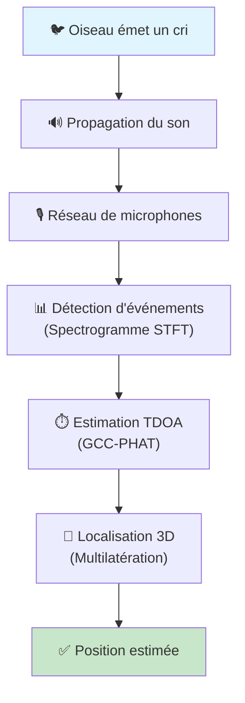
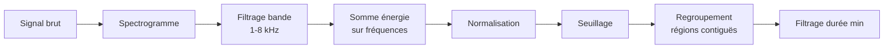
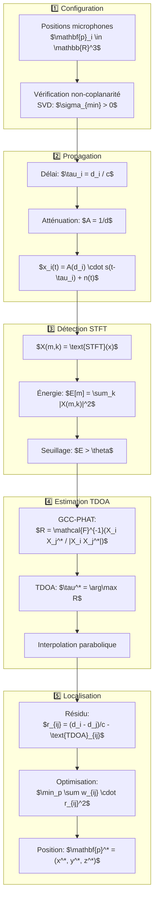

# 🐦 Pipeline de Localisation Acoustique d'Oiseaux

> Documentation technique complète du système InterNest Analyzer

---

## Vue d'Ensemble

Le système InterNest Analyzer est un pipeline de **localisation acoustique 3D** permettant de déterminer la position spatiale d'un oiseau à partir de ses vocalisations captées par un réseau de microphones. Cette technique s'appuie sur des principes de traitement du signal et de géométrie computationnelle.



---

## Étape 1 : Configuration du Réseau de Microphones

### 1.1 Principe Fondamental

Pour localiser une source sonore en **3D**, il faut un minimum de **4 microphones non-coplanaires**. Le système utilise 6 microphones pour une meilleure précision et redondance.

### 1.2 Placement Optimal

La configuration optimale utilise **deux triangles décalés** à différentes hauteurs :

```
Vue de dessus :                    Vue de côté :
                                   
     ▲ (mic 4)                         ▲ z
    /  \                               │  ● mic 4,5,6 (10-17m)
   /    \                              │
  ● ─────● (mic 3,5)                   │
 (mic 3)  \                            │  ● mic 0,1,2 (2-3m)
           \                           └────────────────▶ x
    ● ─ ─ ─ ● (mic 0,2)                     
   (mic 0)  │
            ● (mic 1)
```

**Triangle inférieur (mic 0, 1, 2)** : Z ≈ 2-3m (au sol)  
**Triangle supérieur (mic 3, 4, 5)** : Z ≈ 10-17m (en hauteur), décalé de 60°

### 1.3 Vérification de Non-Coplanarité

La coplanarité est vérifiée via la **décomposition en valeurs singulières (SVD)** :

$$
\mathbf{P} = \mathbf{U} \mathbf{\Sigma} \mathbf{V}^T
$$

Si la plus petite valeur singulière $\sigma_{\min} \approx 0$, les points sont coplanaires.

```python
positions = mic_array.positions  # Matrice N×3
centered = positions - positions.mean(axis=0)
_, singular_values, _ = np.linalg.svd(centered)
is_coplanar = singular_values[-1] < tolerance
```

---

## Étape 2 : Génération et Propagation du Signal

### 2.1 Types de Vocalisations

| Type | Description | Formule |
|------|-------------|---------|
| **Chirp** | Balayage linéaire de fréquence | $s(t) = \sin\left(2\pi \left(f_0 t + \frac{f_1 - f_0}{2T} t^2\right)\right)$ |
| **Song** | Multi-harmoniques avec modulation | $s(t) = \sum_{k=1}^{3} \frac{1}{k} \sin(2\pi f_k(t) \cdot t)$ |
| **Trill** | Oscillation rapide de fréquence | $f(t) = f_0 + \frac{f_1 - f_0}{2}(1 + \sin(2\pi f_m t))$ |
| **Alarm** | Signal pulsé | $s(t) = \sin(2\pi f_c t) \cdot \text{pulse}(t)$ |

### 2.2 Enveloppe d'Amplitude

Pour éviter les artefacts (clics), on applique une enveloppe **attack-release** :

$$
e(t) = \begin{cases} 
\frac{t}{T_a} & 0 \leq t < T_a \quad \text{(attack)} \\
1 & T_a \leq t < T - T_r \\
\frac{T - t}{T_r} & T - T_r \leq t \leq T \quad \text{(release)}
\end{cases}
$$

### 2.3 Modèle de Propagation

#### Délai de propagation

Le son voyage à la vitesse $c = 343 \text{ m/s}$ (à 20°C). Le délai pour atteindre le microphone $i$ est :

$$
\tau_i = \frac{\|\mathbf{p}_{\text{source}} - \mathbf{p}_{i}\|_2}{c} = \frac{d_i}{c}
$$

où $d_i$ est la distance euclidienne entre la source et le microphone $i$.

#### Atténuation (loi en carré inverse)

L'amplitude décroît avec la distance selon :

$$
A(d) = \frac{A_0 \cdot d_{\text{ref}}}{d} \quad \text{pour } d \geq d_{\text{ref}}
$$

Cette loi découle de la conservation de l'énergie sur une sphère en expansion :

$$
I = \frac{P}{4\pi d^2} \implies A \propto \frac{1}{d}
$$

#### Signal reçu

Le signal reçu au microphone $i$ est :

$$
x_i(t) = A(d_i) \cdot s(t - \tau_i) + n_i(t)
$$

où $n_i(t)$ est le bruit ambiant (modélisé comme bruit rose).

### 2.4 Génération du Bruit Ambiant

Le bruit rose (spectre $\frac{1}{f}$) est plus naturel que le bruit blanc :

```python
white_noise = np.random.randn(n_samples)
pink_noise = np.cumsum(white_noise)  # Intégration → 1/f
pink_noise = (pink_noise - np.mean(pink_noise)) / np.std(pink_noise)
```

---

## Étape 3 : Détection des Événements (STFT/Spectrogramme)

### 3.1 Pourquoi l'Analyse Temps-Fréquence ?

Les vocalisations d'oiseaux sont des signaux **non-stationnaires** avec des caractéristiques variant dans le temps. L'analyse temps-fréquence permet de :
- Localiser **quand** ET **à quelle fréquence** un événement se produit
- Être robuste au bruit de fond
- Détecter des signaux de durées et fréquences variables

### 3.2 Transformée de Fourier à Court Terme (STFT)

La STFT découpe le signal en fenêtres et calcule la FFT de chaque fenêtre :

$$
X(m, k) = \sum_{n=0}^{N-1} x[n + mH] \cdot w[n] \cdot e^{-j \frac{2\pi k n}{N}}
$$

où :
- $m$ : indice de la fenêtre temporelle
- $k$ : indice de la fréquence (bin)
- $w[n]$ : fonction fenêtre (Hann)
- $H$ : pas de décalage (hop size)
- $N$ : taille de la FFT

### 3.3 Paramètres Utilisés

| Paramètre | Valeur | Justification |
|-----------|--------|---------------|
| `nperseg` | 1024 | Taille de fenêtre (~23 ms à 44.1 kHz) |
| `noverlap` | 768 | Recouvrement de 75% pour fluidité |
| `nfft` | 2048 | Résolution fréquentielle fine |
| Fenêtre | Hann | Bon compromis résolution/fuites spectrales |

**Résolution fréquentielle** : $\Delta f = \frac{f_s}{N_{\text{FFT}}} = \frac{44100}{2048} \approx 21.5 \text{ Hz}$

**Résolution temporelle** : $\Delta t = \frac{H}{f_s} = \frac{256}{44100} \approx 5.8 \text{ ms}$

### 3.4 Algorithme de Détection



#### Calcul de l'enveloppe d'énergie

$$
E[m] = \sum_{k=k_{\min}}^{k_{\max}} |X(m, k)|^2
$$

avec $k_{\min}$ et $k_{\max}$ correspondant à la bande spectrale des oiseaux (1-8 kHz).

#### Normalisation

$$
\tilde{E}[m] = \frac{E[m]}{\max(E)}
$$

#### Détection par seuil

Un événement est détecté si $\tilde{E}[m] > \theta$ avec $\theta = 0.3$ par défaut.

### 3.5 Extraction des Caractéristiques

Pour chaque événement détecté :

- **Fréquence dominante** : $f_{\text{peak}} = \arg\max_k \sum_m |X(m,k)|^2$
- **Confiance** : moyenne de l'enveloppe d'énergie normalisée
- **Énergie totale** : somme de l'enveloppe sur la durée de l'événement

---

## Étape 4 : Estimation des TDOA (GCC-PHAT)

### 4.1 Principe du TDOA

Le **Time Difference of Arrival** (TDOA) est la différence de temps d'arrivée d'un signal entre deux microphones :

$$
\text{TDOA}_{ij} = \tau_i - \tau_j = \frac{d_i - d_j}{c}
$$

Cette différence définit une **hyperboloïde** de focalisation dans l'espace 3D. L'intersection de plusieurs hyperboloïdes donne la position de la source.

```
        ┌─────────────────────────────────────┐
        │           Hyperboloïde              │
        │                                     │
        │    ●──────────────●                 │
        │   Mic i         Mic j               │
        │                                     │
        │   TDOA = (d_i - d_j) / c            │
        │                                     │
        │   L'oiseau est sur cette surface    │
        └─────────────────────────────────────┘
```

### 4.2 Intercorrélation Classique

L'intercorrélation entre deux signaux $x_i$ et $x_j$ est :

$$
R_{ij}(\tau) = \int_{-\infty}^{+\infty} x_i(t) \cdot x_j(t + \tau) \, dt
$$

Le pic de corrélation indique le décalage temporel $\tau^* = \arg\max_\tau R_{ij}(\tau)$.

En discret (via FFT) :

$$
R_{ij}[k] = \mathcal{F}^{-1}\left\{ X_i[f] \cdot X_j^*[f] \right\}
$$

### 4.3 GCC-PHAT (Generalized Cross-Correlation with Phase Transform)

Le **GCC-PHAT** est une version robuste de l'intercorrélation qui **blanchit le spectre**, le rendant insensible à :
- Le contenu spectral du signal
- Les réverbérations
- Le bruit coloré

$$
R_{\text{PHAT}}(\tau) = \mathcal{F}^{-1}\left\{ \frac{X_i(f) \cdot X_j^*(f)}{|X_i(f) \cdot X_j^*(f)|} \right\}
$$

Seule l'**information de phase** est conservée, d'où le nom "Phase Transform".

```python
# Cross-power spectrum
cross_spectrum = X_i * np.conj(X_j)

# PHAT weighting (whitening)
magnitude = np.abs(cross_spectrum)
phat = cross_spectrum / magnitude  # Normalisation

# GCC-PHAT
gcc = np.real(np.fft.ifft(phat))
```

### 4.4 Raffinement Sub-Échantillon (Interpolation Parabolique)

La résolution du TDOA est limitée par la fréquence d'échantillonnage. Pour améliorer la précision, on utilise une **interpolation parabolique** autour du pic :

Soit $\alpha$, $\beta$, $\gamma$ les valeurs de corrélation aux positions $k-1$, $k$, $k+1$ :

$$
\delta = \frac{\alpha - \gamma}{2(\alpha - 2\beta + \gamma)}
$$

Le décalage raffiné est : $\tau^* = k + \delta$

### 4.5 Calcul de la Confiance

La confiance est basée sur la **proéminence du pic** par rapport au bruit de fond :

$$
\text{prominence} = \frac{R_{\text{peak}} - \mu_{\text{background}}}{\sigma_{\text{background}}}
$$

$$
\text{confidence} = \min\left(1, \frac{\text{prominence}}{10}\right)
$$

### 4.6 Validation Physique

Un TDOA est **physiquement impossible** si :

$$
|\text{TDOA}_{ij}| > \frac{\|p_i - p_j\|}{c}
$$

Le système rejette ces estimations ou réduit leur confiance.

---

## Étape 5 : Localisation par Multilatération

### 5.1 Principe Géométrique

Chaque TDOA définit une **hyperboloïde** où la source peut se trouver. La position est l'intersection de ces surfaces :

$$
\sqrt{(x - x_i)^2 + (y - y_i)^2 + (z - z_i)^2} - \sqrt{(x - x_j)^2 + (y - y_j)^2 + (z - z_j)^2} = c \cdot \text{TDOA}_{ij}
$$

Avec $N$ microphones, on a $\binom{N}{2}$ paires, donc $\binom{6}{2} = 15$ équations hyperboliques.

### 5.2 Formulation du Problème d'Optimisation

On cherche la position $\mathbf{p} = (x, y, z)$ qui minimise l'erreur entre les TDOA mesurés et prédits :

$$
\mathbf{p}^* = \arg\min_{\mathbf{p}} \sum_{(i,j)} w_{ij} \left( \text{TDOA}^{\text{(pred)}}_{ij}(\mathbf{p}) - \text{TDOA}^{\text{(mes)}}_{ij} \right)^2
$$

où les poids $w_{ij}$ sont les confiances des estimations TDOA.

#### TDOA prédit

$$
\text{TDOA}^{\text{(pred)}}_{ij}(\mathbf{p}) = \frac{\|\mathbf{p} - \mathbf{p}_i\| - \|\mathbf{p} - \mathbf{p}_j\|}{c}
$$

### 5.3 Fonction de Résidu

Pour l'optimisation aux moindres carrés :

$$
r_{ij}(\mathbf{p}) = w_{ij} \cdot \left( \frac{d_i(\mathbf{p}) - d_j(\mathbf{p})}{c} - \text{TDOA}_{ij} \right)
$$

Le vecteur résidu complet est $\mathbf{r}(\mathbf{p}) = [r_1, r_2, ..., r_K]^T$ pour $K$ paires.

### 5.4 Algorithme d'Optimisation

On utilise **Levenberg-Marquardt** (via `scipy.optimize.least_squares`) avec :
- Perte **soft L1** pour la robustesse aux outliers
- Contraintes de bornes (position physiquement raisonnable)

```python
result = least_squares(
    fun=residual_function,
    x0=initial_guess,
    bounds=position_bounds,
    method='trf',         # Trust Region Reflective
    loss='soft_l1',       # Robust to outliers
    max_nfev=1000
)
```

### 5.5 Estimation Initiale

Une bonne initialisation accélère la convergence. L'algorithme :

1. Commence au **centroïde** du réseau de microphones
2. Ajuste selon le TDOA de plus haute confiance
3. Si $\text{TDOA} > 0$ : la source est plus proche du mic $j$
4. Si $\text{TDOA} < 0$ : la source est plus proche du mic $i$

$$
\mathbf{p}_0 = \bar{\mathbf{p}}_{\text{mics}} + \text{sign}(\text{TDOA}) \cdot d_{\text{offset}} \cdot \hat{\mathbf{n}}_{ij}
$$

### 5.6 Estimation de l'Incertitude

La **matrice de covariance** de la position estimée est calculée à partir du Jacobien :

$$
\mathbf{C}_p = (\mathbf{J}^T \mathbf{J})^{-1} \cdot \frac{\|\mathbf{r}\|^2}{N - 3}
$$

où $\mathbf{J}$ est le Jacobien de la fonction résidu évalué à la solution.

### 5.7 Confiance Globale

$$
\text{confidence} = \bar{c}_{\text{TDOA}} \cdot e^{-100 \cdot \text{residual}}
$$

- $\bar{c}_{\text{TDOA}}$ : confiance moyenne des estimations TDOA
- Un résidu faible indique un bon ajustement

---

## Résumé de la Pipeline Mathématique



---

## Constantes et Paramètres

| Constante | Valeur | Description |
|-----------|--------|-------------|
| $f_s$ | 44 100 Hz | Fréquence d'échantillonnage |
| $c$ | 343 m/s | Vitesse du son (20°C) |
| $f_{\min}$ | 1 000 Hz | Fréquence minimum (oiseaux) |
| $f_{\max}$ | 8 000 Hz | Fréquence maximum (oiseaux) |
| $\theta$ | 0.3 | Seuil de détection |
| $T_{\min}$ | 20 ms | Durée minimale d'événement |

---

## Précision Attendue

| Condition | Erreur typique |
|-----------|----------------|
| Bruit faible (SNR > 20 dB) | < 1 m |
| Bruit moyen (SNR 10-20 dB) | 1-5 m |
| Bruit élevé (SNR < 10 dB) | 5-20 m |
| Source hors réseau | Erreur accrue |

---

## Références Mathématiques

1. **STFT** : Oppenheim, A. V., & Schafer, R. W. (2010). *Discrete-Time Signal Processing*
2. **GCC-PHAT** : Knapp, C., & Carter, G. (1976). *The generalized correlation method for estimation of time delay*
3. **Multilatération** : Torrieri, D. J. (1984). *Statistical theory of passive location systems*
4. **Interpolation parabolique** : Smith, J. O. (2011). *Spectral Audio Signal Processing*

---

*Documentation générée pour le projet InterNest Analyzer*
